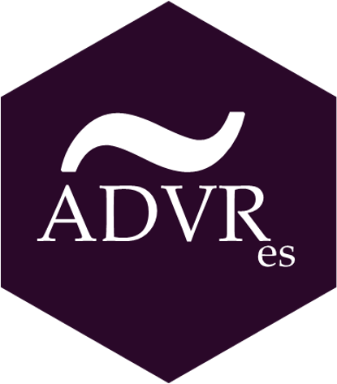

# R Avanzado

<a href="https://amzn.eu/d/00c6NjE"></a>Este repositorio contiene el código y el texto detrás de el libro [R Avanzado](http://adv-r.hadley.nz). El libro fue creado con [Quarto](https://quarto.org/). El libro esta diseñado principalmente para usarios de R que quieran mejor sus habilidades de programación y entendimiento del lenguaje. También debería resultarle útil a programadores que vienen a R desde otros lenguajes, para ayudarlos a entender porque R funciona de la manera en que lo hace.

# Sobre la traducción

Esta traducción de "R Avanzado" es un proyecto personal de David Díaz Rodríguez con el objetivo de facilitar el estudio de conceptos avanzados de programación con R, tanto al propio traductor como a todas aquellas personas de habla hispana que deseen aprender conceptos más avanzados sobre progrmación con R.

Señalar que esta es una traducción textual del libro por lo que cuando el autor se refiere así mismo en primera persona , será Hadley Wickham y no el traductor.

La traducción fue realizada usando Google Translate y fueron corregidos algunos errores gramaticales y de coherencia. Si detecta algún error relacionado con contenido de la traducción, siéntase libre de abrir un issue o un pull request en este [repositorio](https://github.com/davidrsch/adv-res).

## Traducido hasta ahora

-   Bienvenida
-   Prefacio
-   Introducción
-   Fundamentos
    -   Nombres y valores
    -   Vectores
    -   Subconjunto
    -   Flujo de control

# Más información acerca del repositorio

## Diagramas

Omnigraffle:

-   Asegúrese de que el 100 % sea "un punto de posdata": esto garantiza que el tamaño del lienzo coincida con el tamaño físico. Exportación a 300 dpi escalada al 100%.

-   Establezca la cuadrícula en 1 cm con 10 unidades menores. Asegúrese de que haya un relleno de 2 mm alrededor de todos los lados de cada diagrama.

-   Convenciones:

    -   El texto se establece en inconsolata 10pt, con relleno de texto establecido en 3.
    -   Emoji configurado en "Apple Color Emoji" 8pt.
    -   El tamaño escalar predeterminado es de 6 mm x 6 mm.
    -   Los símbolos tienen esquinas redondeadas de 4 puntos y borde ciruela.
    -   Las puntas de flecha deben configurarse al 75%.
    -   Los nombres deben estar coloreados en acero.

Libro:

-   Inconsolata escalada (por fontspec) para que coincida con la fuente principal es 9.42pt.

-   La vista previa al 100 % coincide con el tamaño físico del libro. El ancho máximo del diagrama es de 11 cm.

Markdown

-   Elimine la especificación de dpi de `include_graphics()`, en lugar de confiar en `common.R`. Chunk debería tener `output.width = NULL`.

-   Cuidado con el almacenamiento en caché: después de cambiar el tamaño de una imagen, es posible que deba borrar el caché antes de que se actualice correctamente.

Para comprimir archivos para el editor:

```         
mkdir crc
cp _book/_main.tex crc
cp -r _bookdown_files/*_files crc
cp -r diagrams crc
cp -r screenshots crc
cp -r emoji crc
cp mina.jpg crc
cp krantz.cls crc
cp book.bib crc
rm crc/diagrams/*.graffle

zip -r adv-r-source.zip crc
```

## Code of conduct

Tenga en cuenta que Advanced R se lanza con un [Contributor Code of Conduct](CODE_OF_CONDUCT.md). Al contribuir a este proyecto, usted acepta cumplir con sus términos.

# Advanced R

<a href="https://amzn.eu/d/00c6NjE"></a>This repository contains the code and text behind the [Advanced R](http://adv-r.hadley.nz) book. The book is built with [Quarto](https://quarto.org/). The book is designed primarily for R users who want to improve their programming skills and understanding of the language. It should also be useful for programmers coming to R from other languages, as help you to understand why R works the way it does.

# About the translation

This translation of "Advanced R" is a personal project by David Díaz Rodríguez with the aim of facilitating the study of advanced R programming, both for the translator himself and for all those Spanish-speaking people who wish to learn more advanced concepts about programming with R.

Note that this is a verbatim translation of the book so when the author refer to himself in the first person, it will be Hadley Wickham and not the translator.

The translation was done using Google Translate and some grammar and coherence errors were corrected. If you spot any issue related to the translation content, feel free to open an issue or pull request on this [repository](https://github.com/davidrsch/adv-res).

## Translated so far

-   Welcome
-   Preface
-   Introduction
-   Foundations
    -   Names and values
    -   Vectors
    -   Subsetting
    -   Control flow

# More info about the repository

## Diagrams

Omnigraffle:

-   Make sure that 100% is "one postscript point": this ensures canvas size matches physical size. Export at 300 dpi scaled to 100%.

-   Set grid to 1cm with 10 minor units. Ensure there is 2mm padding around all sides of each diagram.

-   Conventions:

    -   Text is set in inconsolata 10pt, with text padding set to 3.
    -   Emoji set in "Apple Color Emoji" 8pt.
    -   Default scalar size is 6mm x 6mm.
    -   Symbols have 4pt rounded corners and plum border.
    -   Arrow heads should be set to 75%.
    -   Names should be coloured in steel.

Book:

-   Inconsolata scaled (by fontspec) to match main font is 9.42pt.

-   Preview at 100% matches physical size of book. Maximum diagram width is 11cm.

Markdown

-   Remove dpi specification from `include_graphics()`, instead relying on `common.R`. Chunk should have `output.width = NULL`.

-   Beware caching: after changing the size of an image you may need to clear the cache before it is correctly updated.

To zip files to for publisher:

```         
mkdir crc
cp _book/_main.tex crc
cp -r _bookdown_files/*_files crc
cp -r diagrams crc
cp -r screenshots crc
cp -r emoji crc
cp mina.jpg crc
cp krantz.cls crc
cp book.bib crc
rm crc/diagrams/*.graffle

zip -r adv-r-source.zip crc
```

## Code of conduct

Please note that Advanced R is released with a [Contributor Code of Conduct](CODE_OF_CONDUCT.md). By contributing to this project, you agree to abide by its terms.
